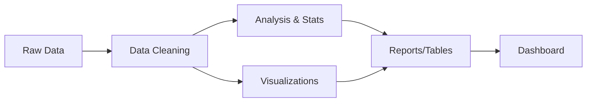

# Quick Start Guide

This guide will help you get started with the Business Analytics project in Positron.

## Prerequisites

Before you begin, ensure you have:

- [x] **Positron IDE** installed
- [x] **R** (version 4.0 or higher)
- [x] **Python** (version 3.8 or higher)
- [x] **Quarto** (for dashboard generation)

## Installation Steps

### 1. Clone the Repository

```bash
git clone https://github.com/glorenjoy/positron_practice.git
cd positron_practice
```

### 2. Set Up Python Environment

```bash
# Create and activate virtual environment
python -m venv venv

# On Windows:
venv\Scripts\activate

# On macOS/Linux:
source venv/bin/activate

# Install Python packages
pip install -r requirements.txt
```

### 3. Install R Packages

Open R or RStudio and run:

```r
# List of required packages
packages <- c(
  "dplyr", "tidyr", "lubridate", "readr",
  "ggplot2", "scales", "knitr", "rmarkdown", "DT"
)

# Install missing packages
install.packages(setdiff(packages, rownames(installed.packages())))
```

## Running the Analysis

### Option 1: Run All Scripts Sequentially

```bash
# Step 1: Clean the data
Rscript scripts/r/data_cleaning.R
# OR use Python version:
# python scripts/python/clean_data.py

# Step 2: Run analysis
python scripts/python/data_analysis.py

# Step 3: Generate visualizations
Rscript scripts/r/visualizations.R
python scripts/python/visualizations.py

# Step 4: Create dashboard
quarto render reports/business_dashboard.qmd
```

### Option 2: Interactive Exploration

1. Open Positron IDE
2. Open the notebook: `notebooks/business_analytics_exploration.ipynb`
3. Run cells interactively to explore the data
4. Experiment with your own queries and visualizations

### Option 3: Use Positron's Integrated Features

In Positron IDE:

1. **Console**: Switch between R and Python consoles
2. **Variables Pane**: Inspect data structures
3. **Plots Pane**: View visualizations inline
4. **Editor**: Edit scripts with syntax highlighting

## Project Workflow



## Output Files

After running the scripts, you'll find:

### Generated Figures (`output/figures/`)

**R Visualizations:**
- `sales_by_region.png` - Regional performance
- `sales_trend.png` - Daily sales with trend line
- `sales_by_category.png` - Category distribution
- `monthly_comparison.png` - Monthly category breakdown
- `rep_performance.png` - Sales rep rankings

**Python Visualizations:**
- `revenue_heatmap_py.png` - Region × Category heatmap
- `sales_distribution_py.png` - Distribution analysis
- `time_series_advanced_py.png` - Advanced time series
- `regional_comparison_py.png` - Regional dashboard
- `category_performance_py.png` - Category performance

### Analysis Tables (`output/tables/`)

- `kpis.csv` - Key performance indicators
- `regional_analysis.csv` - Regional metrics
- `category_analysis.csv` - Category statistics
- `rep_analysis.csv` - Sales rep performance

### Reports (`reports/`)

- `business_dashboard.html` - Interactive HTML dashboard

## Customization

### Using Your Own Data

1. Replace `data/raw/sales_data.csv` with your data
2. Ensure your CSV has these columns:
   - `date` - Transaction date
   - `region` - Geographic region
   - `product_category` - Product type
   - `sales_amount` - Revenue
   - `units_sold` - Quantity
   - `customer_id` - Customer identifier
   - `sales_rep` - Sales representative ID

3. Re-run the cleaning script to process your data

### Modifying Visualizations

**Change Colors:**
```r
# In R scripts
COLORS <- c("#2E86AB", "#A23B72", "#F18F01")
```

```python
# In Python scripts
COLORS = {
    'primary': '#2E86AB',
    'secondary': '#A23B72',
    'accent': '#F18F01'
}
```

**Add New Charts:**
- Copy an existing function
- Modify the aggregation and plotting logic
- Add it to the `save_all_plots()` function

## Troubleshooting

### Common Issues

**Problem:** "Package not found"
**Solution:** Install missing packages using `install.packages()` (R) or `pip install` (Python)

**Problem:** "File not found"
**Solution:** Ensure you're running scripts from the project root directory

**Problem:** "Quarto not found"
**Solution:** Install Quarto from [quarto.org](https://quarto.org/docs/get-started/)

**Problem:** Plots not showing in Positron
**Solution:** Check the Plots pane is open (View → Plots)

### Getting Help

- Check the main [README.md](README.md) for detailed documentation
- Review script comments for function documentation
- Open an issue on GitHub for bugs or questions

## Next Steps

1. ✅ Run the quick start commands above
2. ✅ Explore the generated visualizations
3. ✅ Open the dashboard in your browser
4. ✅ Experiment with the Jupyter notebook
5. ✅ Customize with your own data

## Tips for Positron Users

- **Split Editor**: View R and Python scripts side-by-side
- **Kernel Switching**: Easily switch between R and Python
- **Integrated Terminal**: Run scripts without leaving the IDE
- **Git Integration**: Commit changes directly from Positron
- **Variable Inspector**: See all variables in your workspace

Happy Analyzing! 📊
